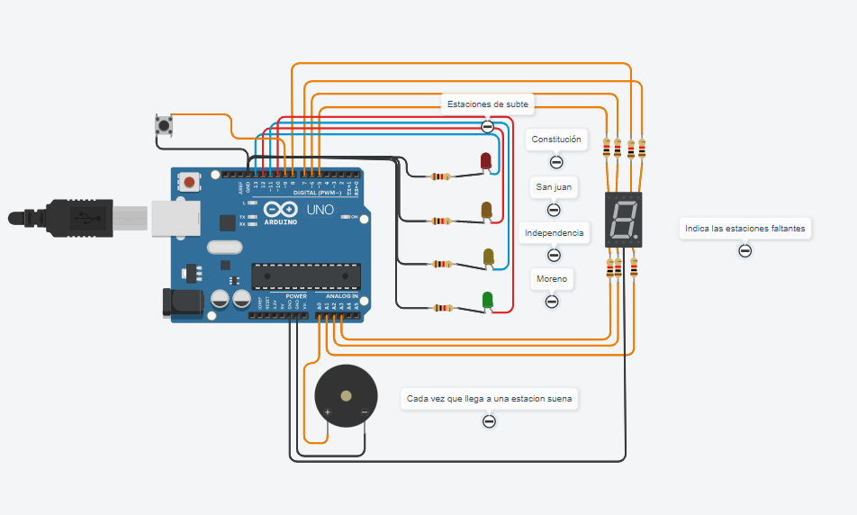

# ⭐ ⭐ ⭐ Proyecto SPD ⭐ ⭐ ⭐

## Integrantes 😎
 
 * Flores Brandon
 * Corimayo Alan
 * Falanga Alejandro
 * Fleitas Ezequiel
 * Yapura Franco

## Proyecto: Estacion de subte



### Descripción

El proyecto se trata Deberá mostrar los leds por estación y el número de estación en el display 7 segmentos y deberá sonar una vez que llegue a cada estación con el buzzer. Pero antes de todo eso necesitamos el botón para poder encender el sistema.


### 👉 Función principal	👈

 El objetivo es implementar un sistema que brinde información visual y auditiva al usuario sobre las estaciones de subte a medida que se acerca a su destino, utilizando un display de 7 segmentos para mostrar la estación actual, LEDs para indicación visual y un buzzer para generar sonidos únicos para cada estación.

---
El sistema comienza apagado y espera a que se presione un botón para iniciar su funcionamiento.

Una vez que se presiona el botón, el sistema se enciende y comienza a mostrar en un display de 7 segmentos la estación de subte a la que se está llegando.

Al mismo tiempo, se encienden LEDs correspondientes a la estación actual.

Cada vez que se llega a una estación, el buzzer emite un sonido específico para esa estación,por lo que el usuario podra escuchar por sonido en que estacion estara.

Después de permanecer en una estación durante un período de tiempo determinado (por ejemplo, 2 segundos), el sistema pasa a la siguiente estación.

El proceso de mostrar la estación actual, encender el LED correspondiente, reproducir el sonido y avanzar a la siguiente estación se repite hasta que se alcanza la última estación, luego hace una vuelta hasta que una vez llega a la primera estacion vuelve normal como siempre

### 💻 Porcion del codigo 💻


```c++

void loop()
{
  if (digitalRead(PULSADOR) == LOW){
    while (digitalRead(PULSADOR) != LOW){
 		prendeYApaga(constitucion ,0,1,1,0,0,1,1,500);
    	prendeYApaga(sanjuan ,1,1,1,1,0,0,1,350);
    	prendeYApaga(independencia ,1,1,0,1,1,0,1,200);
    	prendeYApaga(moreno ,0,1,1,0,0,0,0,100);
      	prendeYApaga(independencia ,1,1,0,1,1,0,1,200);
      	prendeYApaga(sanjuan ,1,1,1,1,0,0,1,350);
    }  
  }
}


void prendeYApaga(int led, int a, int b ,int c, int d , int e, int f,int g ,int sonido){
  digitalWrite(led , HIGH);
  digitalWrite(A , a);
  digitalWrite(B , b);
  digitalWrite(C , c);
  digitalWrite(D , d);
  digitalWrite(E , e);
  digitalWrite(F , f);
  digitalWrite(G , g);
  tone(piezo, sonido, 500);
  delay(3000);
  digitalWrite(led , LOW);
  digitalWrite(A , 0);
  digitalWrite(B , 0);
  digitalWrite(C , 0);
  digitalWrite(D , 0);
  digitalWrite(E , 0);
  digitalWrite(F , 0);
  digitalWrite(G , 0);
    
}

```

## 📌 Link al proyecto 📌

[tinkercard.com](https://www.tinkercad.com/things/h3a26eB00mS "Link al arduino")

